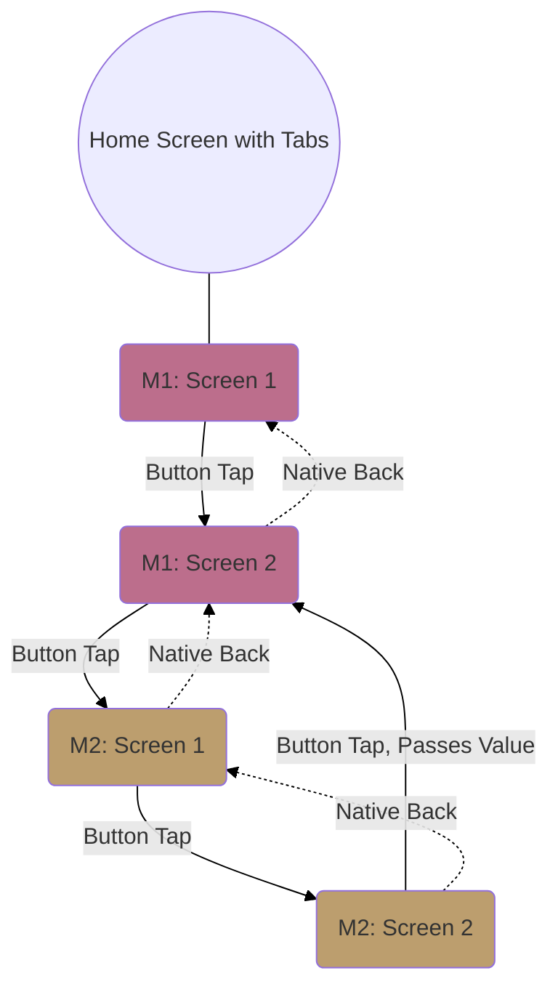
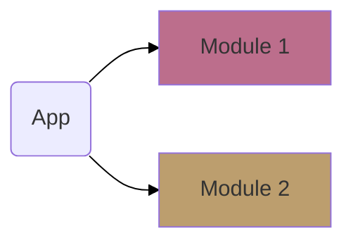

# Flutter PoC Overview

The purpose of this repo is to provide a **PoC for achieving the following requirements**. This not only will provide a base from which an actual app could be built, but will also provide a place for soliciting **community input on code and pattern refinement**.

## Requirements
- Tabbed navigation, without losing state when switching tabs
- Show a flow of screens from Module 1, with some screens embedded from Module 2, **without these two modules being coupled** beyond interface requirements.

## User Flow
- Module 1 = `M1`
- Module 2 = `M2`

## General Module Architecture

The root app will depend on Module 1 and Module 2, implementing them and providing parameters to configure them appropriately.

The modules need to be independent of each other; M1 and M2 can't be hardcoded to reference the other.

Module 1 should show some screens from Module 2 as if they're part of a continuous flow.

# Outstanding Questions / Known Issues

- [ ] How should M1p1 get the value from M1p2 when you go from M1p2 to M1p1 (native back button or the screen button)?

<!-- 
# Github Pages Notes

Local dev: `jekyll build --config _config.yml,_config_local.yml --watch` 

# Flutter Notes

Start: 
-->